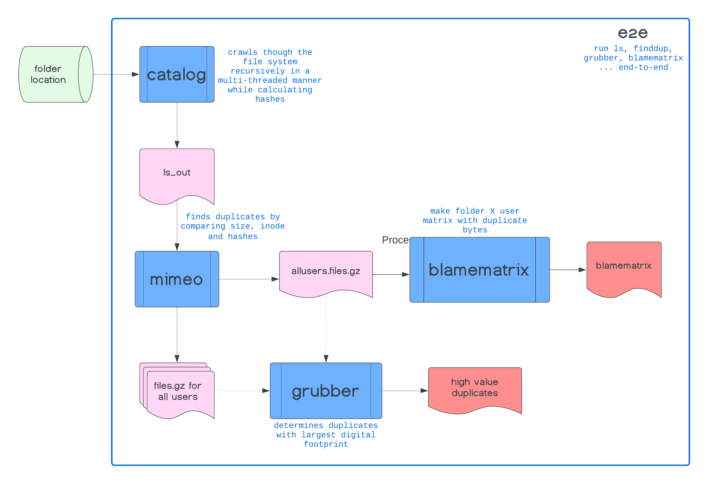

# :rocket: spacesavers2 :rocket:

## Table of Contents:
 - [Background](#background)
 - [Basic Commands](##spacesavers2-has-the-following-basic-commands)
 - [Flow Diagram](#spacesavers2-typical-workflow-looks-like-this)
 - [Detailed Documentation](https://ccbr.github.io/spacesavers2)

## Background

Welcome! `spacesavers2`: 

- crawls through the provided folder (and its subfolders), 
- gathers stats for each file like size, inode, user/group information, etc., 
- calculates unique hashes for each file,
- using the information gathers determines "duplicates",
- reports "high-value" duplicates, i.e., the ones that will give back most diskspace, if deleted,and
- makes a "counts-matrix" style matrix with folders as rownames and users a columnnames with each cell representing duplicate bytes

> New improved parallel implementation of [`spacesavers`](https://github.com/CCBR/spacesavers). `spacesavers` is soon to be decommissioned!

> Note: `spacesavers2` requires [python version 3.11](https://www.python.org/downloads/release/python-3110/) or later and the [xxhash](https://pypi.org/project/xxhash/) library. These dependencies are already installed on biowulf (as a conda env). The enviroment for running `spacesavers2` can get set up using:
> ```bash
> . "/data/CCBR_Pipeliner/db/PipeDB/Conda/etc/profile.d/conda.sh" && \
> conda activate py311
> ```
## `spacesavers2` has the following Basic commands:

- spacesavers2_catalog
- spacesavers2_mimeo
- spacesavers2_grubbers
- spacesavers2_blamematrix
- spacesavers2_e2e

## `spacesavers2` typical workflow looks like this:



Check out the detailed [documentation](https://ccbr.github.io/spacesavers2/) for more details. Please reach out to [Vishal Koparde](mailto:vishal.koparde@nih.gov) with queries/comments.

<hr>
<p align="center">
	<a href="#rocket-spacesavers2-rocket">Back to Top</a>
</p>
