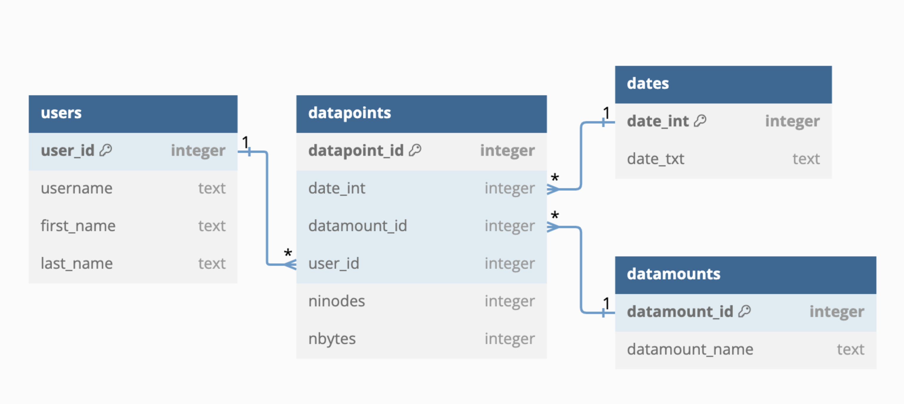

## spacesavers2_pdq_create_db

pdq = Pretty Darn Quick

[`spacesavers2_pdq`](pdq.md) creates TSV (or JSON) file per-datamount per-run (typically per-date). If run daily, this soon creates a lot of files to keep track of. Hence, it is best to save the data in a sqlite db. This command create the basic schema for that db. The schema looks like this:



### Inputs
 - `--filepath`: where to create the ".db" file.
 - `--overwrite`: toggle to overwrite if the ".db" file already exists.

```bash
usage: spacesavers2_pdq_create_db [-h] -f FILEPATH [-o | --overwrite | --no-overwrite] [-v]

spacesavers2_pdq_create_db: create a sqlitedb file with the optimized schema.

options:
  -h, --help            show this help message and exit
  -f FILEPATH, --filepath FILEPATH
                        spacesavers2_pdq_create_db will create this sqlitedb file
  -o, --overwrite, --no-overwrite
                        overwrite output file if it already exists. Use this with caution as it will delete existing file and its contents!!
  -v, --version         show program's version number and exit

Version:
    v0.13.0-dev
Example:
    > spacesavers2_pdq_create_db -f /path/to/sqlitedbfile
```

### Output

## db file

sqlite ".db" file with 4 tables

```bash
% sqlite3 pdq.db
SQLite version 3.26.0 2018-12-01 12:34:55
Enter ".help" for usage hints.
sqlite> .table
datamounts  datapoints  dates       users
sqlite> .schema
CREATE TABLE users (
                        user_id INTEGER PRIMARY KEY,
                        username TEXT NOT NULL,
                        first_name TEXT NOT NULL,
                        last_name TEXT NOT NULL
                    );
CREATE TABLE dates (
                        date_int INTEGER PRIMARY KEY,
                        date_text TEXT UNIQUE NOT NULL
                    );
CREATE TABLE datamounts (
                        datamount_id INTEGER PRIMARY KEY,
                        datamount_name TEXT UNIQUE NOT NULL
                    );
CREATE TABLE datapoints (
                        datapoint_id INTEGER PRIMARY KEY,
                        date_int INTEGER,
                        datamount_id INTEGER,
                        user_id INTEGER,
                        ninodes INTEGER,
                        nbytes INTEGER,
                        FOREIGN KEY (user_id) REFERENCES users(user_id),
                        FOREIGN KEY (datamount_id) REFERENCES datamounts(datamount_id),
                        FOREIGN KEY (date_int) REFERENCES dates(date_int)
                    );
```
